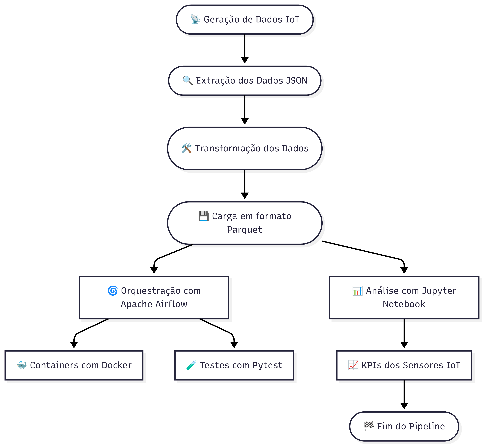
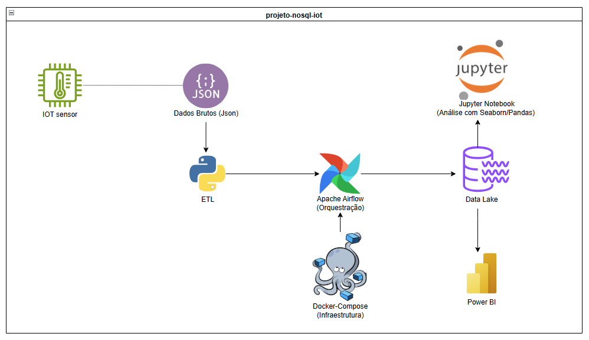
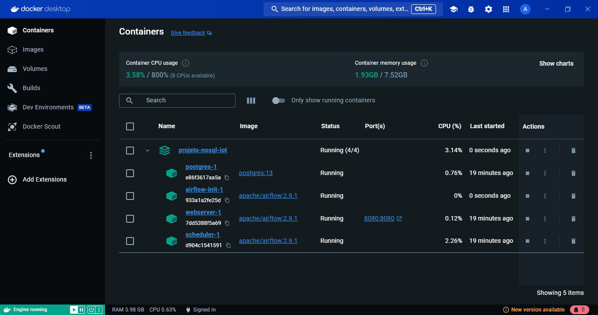

# Projeto NoSQL IoT - Engenharia de Dados com Apache Airflow + Docker


Este projeto simula um caso real da Petrobras: sensores IoT monitoram bombas e compressores em plataformas offshore. Esses dados chegam em JSON, são tratados com Python e orquestrados com Apache Airflow, e salvos como Parquet para análise.

---

## 📂 O que você precisa ter instalado?

### 1. [Python 3.12+](https://www.python.org/downloads/)
### 2. [Git](https://git-scm.com/)
### 3. [Docker Desktop](https://www.docker.com/products/docker-desktop/)
### 4. [Visual Studio Code (VSCode)](https://code.visualstudio.com/) (opcional, mas recomendado)

---

## 🔄 Clonar o projeto

Abra o terminal e digite:

```bash
git clone https://github.com/Adrianogvs/projeto-nosql-iot.git
cd projeto-nosql-iot
```

---

## 📊 Criar ambiente virtual e instalar as dependências

```bash
python -m venv .venv
.venv\Scripts\activate   # Windows
# source .venv/bin/activate   # Linux/macOS

pip install -r airflow/requirements.txt
```

---

## 🚀 Subir o Apache Airflow com Docker

### 1. Rode os containers:
```bash
docker-compose up -d
```

### 2. Acesse o Airflow no navegador:
```
http://localhost:8080
```
- **Usuário**: `admin`
- **Senha**: `admin`

---

## 📁 Estrutura de Pastas

```bash
projeto-nosql-iot/
├── .github/
│   └── workflows/
│       └── python-pipeline.yml         # CI/CD com GitHub Actions
├── airflow/
│   ├── dags/
│   │   └── dag_pipeline.py             # DAG do Airflow
│   ├── logs/                           # Logs do Airflow
│   ├── plugins/                        # Plugins (se necessário)
│   ├── scripts/
│   │   └── gerar_dados_json.py         # Script para gerar JSON simulado
│   └── requirements.txt                # Requisitos do Airflow
├── data/
│   ├── lake/
│   │   └── sensores_lake.parquet       # Arquivo final
│   ├── processed/
│   │   ├── sensores_extraidos.csv
│   │   ├── sensores_extraidos.parquet
│   │   ├── sensores_transformados.csv
│   │   └── sensores_transformados.parquet
│   └── raw/
│       └── sensores_simulados.json     # Dados brutos simulados
├── notebooks/
│   └── exploracao_inicial.ipynb        # Análises exploratórias
├── src/
│   ├── __init__.py
│   ├── carga.py                        # Carrega dados finais
│   ├── extracao.py                     # Extrai dados do JSON
│   ├── pipeline.py                     # Executa pipeline completo
│   └── transformacao.py                # Transforma os dados extraídos
├── tests/
│   └── test_transformacao.py           # Testes unitários da transformação
├── docker-compose.yml                 # Configuração do Docker
└── README.md                          # Documentação principal
```

---

## 🔄 Fluxo do Pipeline de Dados IoT

A imagem abaixo representa todo o fluxo do projeto, desde a simulação dos dados até a análise final dos sensores:



---

## 🛠️ Arquitetura do Projeto

A imagem abaixo resume a arquitetura geral do projeto `projeto-nosql-iot`, desde a simulação dos sensores IoT até a visualização dos dados:



---

## ⏰ Executar o pipeline (via Airflow)

1. Acesse o navegador em `http://localhost:8080`
2. Ative a DAG `pipeline_iot_nosql`
3. Clique no botão ▶️ para rodar manualmente
4. Veja o gráfico com as etapas

---

## ⚖️ Executar manualmente pelo terminal (sem Airflow)

```bash
# Rodar o pipeline completo com Python:
python src/pipeline.py
```

---

## 🔧 Rodar os testes

```bash
# Windows
$env:PYTHONPATH="." ; pytest tests/

# Linux/macOS
PYTHONPATH=. pytest tests/
```

---

## 📅 Integração Contínua (CI) com GitHub Actions

Este projeto possui uma esteira de CI implementada com GitHub Actions que executa automaticamente:

- Instalação de dependências
- Execução dos scripts ETL (`gerar_dados_json.py`, `extracao.py`, `transformacao.py`, `carga.py`)
- Execução dos testes unitários com `pytest`
- Validação do repositório a cada `push` ou `pull request` na branch `main`

> Veja os resultados na aba **Actions** do repositório

---

## ⚖️ Como o Projeto Foi Construído (Etapas)

### 1. Planejamento da Arquitetura
- Estrutura baseada em ETL (extração, transformação e carga)
- Apache Airflow como orquestrador, Docker como infraestrutura

### 2. Simulação de Dados IoT
- Script `gerar_dados_json.py` simula sensores de bombas e compressores

### 3. Construção do Pipeline
- **Extração** (`extracao.py`): JSON para DataFrame
- **Transformação** (`transformacao.py`): limpeza, tipos, normalização
- **Carga** (`carga.py`): salva em Parquet no `data/lake/`
- **DAG Airflow**: controla a ordem e dependências com `dag_pipeline.py`

### 4. Contêners com Docker
- `docker-compose.yml` sobe os serviços: Airflow (webserver, scheduler), PostgreSQL (opcional)

### 5. Testes Automatizados
- `pytest` em `tests/test_transformacao.py`

### 6. Análise de KPIs com Jupyter
- `exploracao_inicial.ipynb` com pandas, matplotlib, seaborn

---

## 📊 Análise de Desempenho dos Sensores IoT

Simula sensores monitorando bombas e compressores em plataformas offshore.
Baseados nos arquivos `.parquet`, analisamos:

- Distribuição por tipo de sensor
- Médias e desvios
- Evolução temporal
- Anomalias detectadas

Ferramentas usadas:
- `pandas`, `matplotlib`, `seaborn`

Notebook: `notebooks/exploracao_inicial.ipynb`

---

## 📸 Prints do Funcionamento

### Docker Desktop com os containers ativos:


### DAG executada com sucesso no Airflow:


---

## 📊 Possíveis Evoluções Futuras

- Integração com MongoDB Atlas real
- Deploy do Data Lake em S3 ou Azure Blob Storage
- Dashboard com Streamlit ou Power BI
- Processamento em tempo real com Apache Kafka
- CD para deploy automatizado com Render ou EC2

---

## 👤 Autor

**Adriano Vilela**  
Engenheiro de Dados em formação | Pythonista em construção  
[LinkedIn](https://linkedin.com/in/adrianogvs) • [GitHub](https://github.com/Adrianogvs)

---

Pronto! Agora é só apertar o play na DAG e ver a mágia acontecer! 🚀