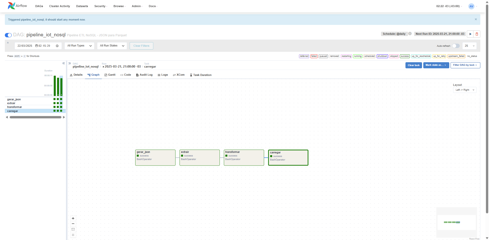

# Projeto NoSQL IoT - Engenharia de Dados com Apache Airflow + Docker


Este projeto simula um caso real da Petrobras: sensores IoT monitoram bombas e compressores em plataformas offshore. Esses dados chegam em JSON, são tratados com Python e orquestrados com Apache Airflow, e salvos como Parquet para análise.

---

## O que você precisa ter instalado?

### 1. [Python 3.12+](https://www.python.org/downloads/)

### 2. [Git](https://git-scm.com/)

### 3. [Docker Desktop](https://www.docker.com/products/docker-desktop/)

### 4. [Visual Studio Code (VSCode)](https://code.visualstudio.com/) (opcional, mas recomendado)

---

## Clonar o projeto

Abra o terminal e digite:

```bash
git clone https://github.com/SEU_USUARIO/projeto-nosql-iot.git
cd projeto-nosql-iot
```

---

## Criar ambiente virtual e instalar as dependências

```bash
python -m venv .venv
.venv\Scripts\activate   # Windows
# source .venv/bin/activate   # Linux/macOS

pip install -r airflow/requirements.txt
```

---

## Subir o Apache Airflow com Docker

### 1. Rode os containers:

```bash
docker-compose up -d
```

### 2. Acesse o Airflow no navegador:

```
http://localhost:8080
```

- **Usuário**: `admin`
- **Senha**: `admin`

---

## Estrutura de Pastas

```bash
projeto-nosql-iot/
├── .github/
│   └── workflows/
│       └── python-pipeline.yml         # CI/CD com GitHub Actions
├── airflow/
│   ├── dags/
│   │   └── dag_pipeline.py             # DAG do Airflow
│   ├── logs/                           # Logs do Airflow
│   ├── plugins/                        # Plugins (se necessário)
│   ├── scripts/
│   │   └── gerar_dados_json.py         # Script para gerar JSON simulado
│   └── requirements.txt                # Requisitos do Airflow
├── data/
│   ├── lake/
│   │   └── sensores_lake.parquet       # Arquivo final
│   ├── processed/
│   │   ├── sensores_extraidos.csv
│   │   ├── sensores_extraidos.parquet
│   │   ├── sensores_transformados.csv
│   │   └── sensores_transformados.parquet
│   └── raw/
│       └── sensores_simulados.json     # Dados brutos simulados
├── notebooks/
│   └── exploracao_inicial.ipynb        # Análises exploratórias
├── src/
│   ├── __init__.py
│   ├── carga.py                        # Carrega dados finais
│   ├── extracao.py                     # Extrai dados do JSON
│   ├── pipeline.py                     # Executa pipeline completo
│   └── transformacao.py                # Transforma os dados extraídos
├── tests/
│   └── test_transformacao.py           # Testes unitários da transformação
├── docker-compose.yml                 # Configuração do Docker
└── README.md                          # Documentação principal
```

---

## Fluxo do Pipeline de Dados IoT

A imagem abaixo representa todo o fluxo do projeto, desde a simulação dos dados até a análise final dos sensores:


---

## Arquitetura do Projeto

A imagem abaixo resume a arquitetura geral do projeto `projeto-nosql-iot`, desde a simulação dos sensores IoT até a visualização dos dados:


---


## Executar o pipeline (via Airflow)

1. Acesse o navegador em `http://localhost:8080`
2. Ative a DAG `pipeline_iot_nosql`
3. Clique no botão ▶️ para rodar manualmente
4. Veja o gráfico com as etapas:

---

## Executar manualmente pelo terminal (sem Airflow)

```bash
# Rodar o pipeline completo com Python:
python src/pipeline.py
```

---

## Rodar os testes

```bash
# Windows
$env:PYTHONPATH="." ; pytest tests/

# Linux/macOS
PYTHONPATH=. pytest tests/
```

---

## Como o Projeto Foi Construído (Etapas)

### 1. Planejamento da Arquitetura
- Definimos uma estrutura baseada em extração, transformação e carga (ETL/ELT).
- Escolhemos o Apache Airflow para orquestrar e Docker para facilitar a implantação.

### 2. Simulação de Dados IoT
- Criado um script em `airflow/scripts/gerar_dados_json.py` que simula sensores de bombas e compressores em plataformas offshore.
- Esse script gera um arquivo JSON com 50 registros.

### 3. Construção do Pipeline
- **Extração** (`src/extracao.py`): Lê o JSON simulado e converte para DataFrame.
- **Transformação** (`src/transformacao.py`): Limpeza, conversão de tipos e normalização.
- **Carga** (`src/carga.py`): Salva os dados em formato Parquet no diretório `data/lake/`.
- **Orquestração com DAG Airflow**: Criamos a DAG `dag_pipeline.py` que chama os scripts em ordem.

### 4. Contêinerização com Docker
- Criado `docker-compose.yml` com os serviços: PostgreSQL, Webserver, Scheduler e Init para Airflow.
- Montadas as pastas `./src`, `./data`, `./airflow` como volumes no contêiner.

### 5. Validação com Testes
- Criado `tests/test_transformacao.py` usando `pytest` para validar a transformação dos dados.

### 6. Análise com Jupyter Notebook
- Criado `notebooks/exploracao_inicial.ipynb`.
- Leitura do Parquet final e geração de gráficos com `matplotlib` e `seaborn`.

---

## Análise que Simula o desempenho dos Sensores IoT que Monitoram Bombas e Compressores em Plataformas Offshore - Petrobras

### Contexto
Essa análise simula a atuação de sensores inteligentes em plataformas offshore, monitorando bombas e compressores. A análise tem como base os dados transformados e salvos no formato Parquet (`data/lake/sensores_lake.parquet`) após o pipeline.

Com os dados estruturados, utilizamos Python + Pandas para visualizar e entender os seguintes KPIs:
- Distribuição por tipo de sensor
- Médias e desvios dos valores capturados
- Evolução dos sensores ao longo do tempo
- Detecção de anomalias ou valores fora do padrão

### Exemplos de Análises Geradas
- Gráfico de linha para temperatura ao longo do tempo
- Boxplot comparando valores de sensores
- Histogramas por tipo de sensor
- Contagem de sensores por tipo

### Ferramentas
- `pandas`
- `matplotlib`
- `seaborn`

> Você pode executar a análise abrindo o Jupyter Notebook em `notebooks/exploracao_inicial.ipynb`

---

## Prints do Funcionamento

### Docker Desktop com os containers ativos:


### DAG executada com sucesso no Airflow:


---

## Possíveis Evoluções

- Integração com MongoDB Atlas real
- Deploy na nuvem (S3 / Azure Blob)
- Visualização com Streamlit ou Power BI
- Kafka para streaming de dados

---

## Autor

**Adriano Vilela**\
Engenheiro de Dados em formação | Pythonista em construção\
[LinkedIn](https://linkedin.com/in/adrianogvs) • [GitHub](https://github.com/Adrianogvs)

---

Pronto! Agora é só apertar o play na DAG e ver a mágia acontecer!